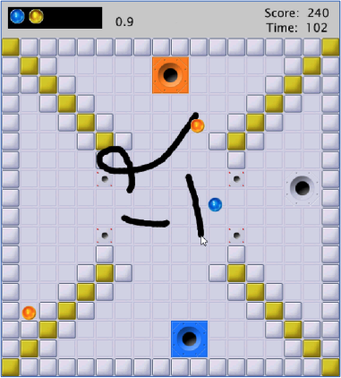
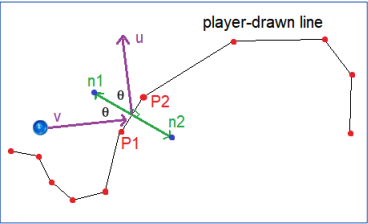

# Ink Ball Game

A Java-based arcade puzzle game developed using the **Processing** graphics library and managed by **Gradle**. 

---
### Screencap of the Game


--- 
### Illustration of the Movements


---

## 🎮 Game Objective

Direct coloured balls into matching holes using strategically drawn lines. Correct matches increase the score, while mismatches result in penalties. Win the game by successfully capturing all balls before time runs out.

---

## 🚀 Set-up of the Program

### Prerequisites

- Java 8
- Gradle
- Processing Core Library (`org.processing:core:3.3.7`)

### Running the Game

```bash
gradle run
```

---

## ⚙️ Game Configuration

The `config.json` defines:

- **layout**: text file (18x18 grid) that maps entities (`X`, `S`, `H`, `B0`, etc.)
- **time**: time limit for each level
- **spawn_interval**: time between ball spawns
- **score modifiers**: values added/subtracted per capture or error

---

## 🎮 Gameplay Mechanics

- **Ball Movement**: Velocity (±2, ±2) per frame, changes on collisions.
- **Walls**:
  - `X` = Static wall (reflects balls)
  - `1–4` = Colour wall (reflects and changes colour)
- **Holes**: 2x2 areas that attract matching balls. Grey balls/hole are neutral.
- **Drawn Lines**:
  - Left-click: Draw
  - Right-click: Remove
  - Reflect balls once then disappear
- **Spawning**:
  - Spawners (`S`) release balls at `spawn_interval`
  - Balls can also appear directly via layout using `B0`, `B1`...

---

## 🧠 Player Controls

- `Left Click`: Draw line
- `Right Click`: Erase line
- `Spacebar`: Pause / unpause game
- `r`: Restart level or game

---

## 🧪 Testing & Coverage

Unit tests are in `src/test/`. Use JUnit and jacoco:

```bash
./gradlew test jacocoTestReport
```

---

Enjoy guiding the ink balls home!
